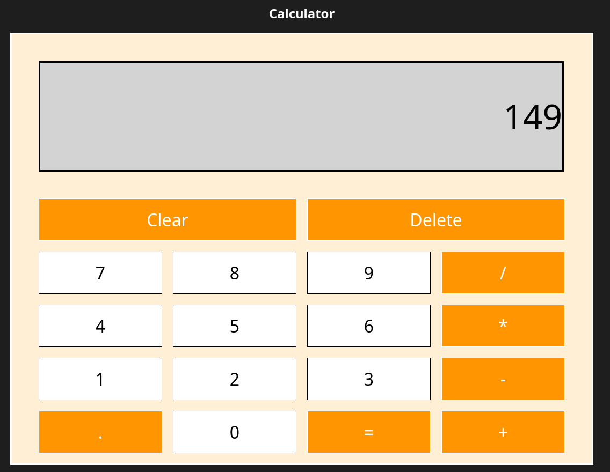

# calculator
The Odin project : Calculator

Project Description : Create a interactive calculator with basic math operation ('add','subtract','multiple' and 'divide')

Feature: Perform basic math operation ('add','subtract','multiple' and 'divide')
         Backspace / Delete key to remove charactor.
         Clear button to clear display of calculator

Built with : Typescript, HTML, CSS

